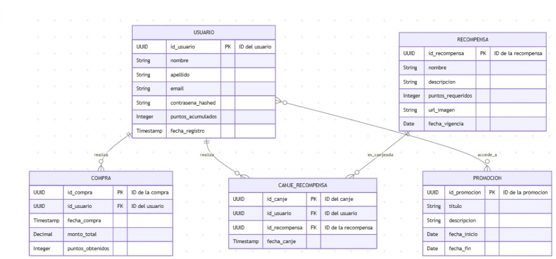

# Resbaladera La Tradicional Aplicación Móvil
Este proyecto se enfoca en la creación de un sistema de fidelización digital para el negocio "Resbaladera La Tradicional". A través de la implementación de un modelo de base de datos relacional, se busca tener un control completo sobre los aspectos clave de la aplicación, como la gestión de usuarios, el registro de compras y el programa de recompensas. La estructura de la base de datos permite rastrear información vital de los clientes, como sus puntos acumulados y su historial de transacciones. Además, se incluyen detalles sobre las promociones y las recompensas disponibles, así como un registro de los canjes que realiza cada usuario. El proyecto incluye scripts SQL autónomos para crear la estructura de datos que soporta esta lógica de negocio.

Análisis del Modelo de Entidad-Relación
## 1. Capa de Persistencia de Datos y Estructuras
El modelo de datos se ha diseñado para ser simple y eficiente, cubriendo las necesidades principales de la aplicación: gestión de usuarios, registro de compras, canje de recompensas y promociones.

## Entidades y Atributos
## USUARIO
Esta entidad representa a cada cliente que se registra en la aplicación.
- id_usuario: Clave primaria (PK), tipo UUID. Identificador único del usuario.
- nombre, apellido, email: Atributos de tipo String para la información de contacto.
- contrasena_hashed: String para almacenar la contraseña encriptada.
- puntos_acumulados: Integer para el saldo de puntos del usuario.
- fecha_registro: Timestamp para la fecha y hora de creación de la cuenta.

## COMPRA
Esta entidad registra cada transacción realizada por un usuario.
- id_compra: Clave primaria (PK), tipo UUID.
- id_usuario: Clave foránea (FK), tipo UUID. Relaciona la compra con el USUARIO.
- fecha_compra: Timestamp de la transacción.
- monto_total: Decimal para el valor de la compra.
- puntos_obtenidos: Integer que representa los puntos ganados.

## RECOMPENSA
Esta tabla define las diferentes recompensas que los usuarios pueden canjear.
- id_recompensa: Clave primaria (PK), tipo UUID.
- nombre, descripcion: String para el detalle de la recompensa.
- puntos_requeridos: Integer para la cantidad de puntos necesarios.
- url_imagen: String para la URL de la imagen de la recompensa.
- fecha_vigencia, fecha_fin: Date para el período de validez.

## CANJE_RECOMPENSA
Esta es una tabla de relación que registra cuándo un usuario canjea una recompensa.
- id_canje: Clave primaria (PK), tipo UUID.
- id_usuario: Clave foránea (FK) que relaciona el canje con el USUARIO.
- id_recompensa: Clave foránea (FK) que relaciona el canje con la RECOMPENSA.
- fecha_canje: Timestamp para la fecha del canje.

## PROMOCION
Esta tabla almacena las promociones disponibles para los usuarios.
- id_promocion: Clave primaria (PK), tipo UUID.
- titulo, descripcion: String para el contenido de la promoción.
- fecha_inicio, fecha_fin: Date para el período de validez.

## 2. Relaciones
- USUARIO y COMPRA: Relación de uno a muchos (1:N). Un usuario puede realizar múltiples compras (realiza), pero cada compra está asociada a un único usuario.

- USUARIO y CANJE_RECOMPENSA: Relación de uno a muchos (1:N). Un usuario puede realizar múltiples canjes (realiza), pero cada canje pertenece a un solo usuario.

- RECOMPENSA y CANJE_RECOMPENSA: Relación de uno a muchos (1:N). Una recompensa puede ser canjeada múltiples veces (es_canjeada), pero cada canje está asociado a una única recompensa.

- USUARIO y PROMOCION: Relación de uno a muchos (1:N). La imagen muestra que un usuario puede accede_a a muchas promociones, pero cada promoción es una entidad independiente que no depende directamente de un usuario. Es más preciso decir que la aplicación presenta las promociones a los usuarios.
